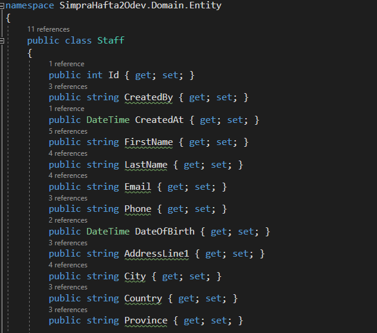

[](https://classroom.github.com/a/iGZu94G3)
# aw2

Asagida verilen modeli kullanarak GetAll, GetById , Put , Post , Delete methodlarini icen bir controller implement ediniz. 

EF ile generic repository ve UnitOfWork kullanabilirsiniz.

Put  ve Post apilerin de model validation hazirlayiniz.  Fluent validation kullaniniz. 

Extra olarak 2 tane alana gore (Query parameter) filtreleme yapan Filter apisi ekleyiniz (GET) ve WHERE sarti ile database den filtreleme yapiniz. 

Generic Repository uzerinde Where sartini implement ediniz. 

SOLID e uymaya ozen gosteriniz . 

Proje icerisinde sadece odev ile ilgili kisimlara yer veriniz. Kullanilmayan controller ve methodlari gondermeyiniz. Yorum satiri gondermeyininiz.

Model icin initial migration dosyasini ekleyiniz. 

Readme file uzerinde nasil calisacagina dair gerekli aciklamalara yer veriniz. 

Email alanini unique olmalidir. 

```
  public class Staff  
    { 
        public int Id { get; set; } 
        public string CreatedBy { get; set; } 
        public DateTime CreatedAt { get; set; } 
        public string FirstName { get; set; } 
        public string LastName { get; set; } 
        public string Email { get; set; } 
        public string Phone { get; set; } 
        public DateTime DateOfBirth { get; set; } 
        public string AddressLine1 { get; set; } 
        public string City { get; set; } 
        public string Country { get; set; } 
        public string Province { get; set; } 
        [NotMapped] 
        public string FullName 
        { 
            get { return FirstName + " " + LastName; } 
        } 
    }
```
# Simpra-.NET-Bootcamp-Homework2

## Projede Kullanınan Teknolojiler
.Net Core 6 Apı </br>
MSSQL</br>
Swagger UI </br>
Entity Framework Code First </br>
Repository Design Pattern </br>
Onion Architecture </br>


## Entity Framework Code First</br>
Projede veri tabanı code first yaklaşımı ile yapılmıştır. Buradaki amaç veritabanı arayüzü ile etkileşimi minimize etmektir. Entity framework
Code First yaklaşımının en büyük avantajı projedeki modeli tam hakimiyetle istediğimiz şekilde kullanmaktır.</br>
Projemde oluşturmuş olduğum Code First yaklaşımı şu şekilde;




## Repository Desing Patern
Veri tabanını tasarlarken bir standart üzerine oluşturmayı hedefleriz. Veri tabanı işlemlerini yaparken yoğun bir tekrarlama ile karşılaşmaktayız.İşte bu yüzden Repository Design Patern bu tekrarlama işlemlerini ortadan kaldırıp daha pratik bir şekilde bu işlemleri yapmamızı sağlamaktadır.</br>
Projemde oluşturmuş olduğum Repository Design Patern şu şekilde;


## Onion Architecture 
Klasik n katmalı mimariden farkı katmanlar arasında gevşek bir bağ mevcuttur. Bu gevşek olan bağın sağladığı fayda ileride örneğin bir veri tabanı değiştirmek istediğimiz  zaman mssqlden mongodb veritabanına  geçiş yaptığımız taktirde n katmanlı mimariye göre daha az maliyetli ve kolaydır. Bağımlılığın en alt seviyede olması ve anlamasının daha kolay olması ve ve ve en önemlisi SOLID prensiplerine uyduğu için bu mimariyi tercih ettim.
### Katmanlar
#### Domaim Katmanı
Entitylerle ilgili olan exceptionların tutulduğu katmandır.</br></br>
#### Core Katmanı
Domain ile iş katmanı arasında soyutlama katmanıdır. Tüm servis arayüzleri burada tanımlanır.</br></br>
#### Persistence Katmanı
Veri tabanı operasyonlarının ve veri erişimini yürüten katmandır.DbContext,Migration,Configurations gibi yapılar bu katmanda bulunur.</br></br>
#### Infrastructure Katmanı
Veri tabanı dışındaki operasyonları yürütür.</br></br>
#### Presentation Katmanı
Kullanıcının iletişim kurduğu katmandır.

Uyguladığım mimari şu şekilde;


##  Genel Değerlendirme 

Verilen görev doğrultusunda her istenileni elimden geldiğince yerine getirmeye çalıştım. Veritabanımı MSSQL de oluşturup verilerimi oraya kaydettim.


Bunu kendi bilgisayarınızda görebilmek için "script.sql" dosyasını indirip Mssql e kurarsanız projeyle bağlantısını sağlayabilirsiniz. Ben 2 şartlı filtreleme de isime ve şehire göre yaptım.Girdiğim verilere göre de "Ayşe" ve "Çanakkale" araması yaparsanız ismi Ayşe olup Çanakkale'de yaşayanlar listelenecektir. Ben test ederken bu şekilde ilerledim. Umarım eksik ve ya yanlış bir şey yapmamışımdır. </br> </br>


Çok Teşekkürler  :smile:
